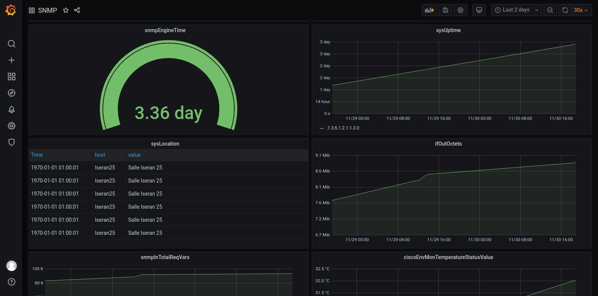

# GOVISEUR

Goviser est une application permettant de superviser des équipements à distances.

## Dependance
- docker & docker-compose
- golang (avec github.com/influxdata/influxdb1-client & github.com/gosnmp/gosnmp)

## Installation

Une fois connectez au réseau de l'université Savoie-mont-Blanc:

1. rendez-vous dans le dossier Configuration et lancer le container via la commande docker-compose up -d
2. refaite la même commande dans le dossier Log
3. enfin lancer le script python qui se trouve dans le dossier Surveillannce via la commande go run surveillance.go
4. sur un naviguateur aller a l'url localhost:5000 et configurez les service snmp
5. configurez vos différents graphique sur grafana à l'adresse localhost:3000

## Utilisation

Connectez vous à l'interface web de l'application.

Page d'accueil :
Tableau de valeur affichant les données récupéré sur les équipements.

Page de configuration:
Formulaire d'insertion de donnée pour les machines à superviser.

## Statut du projet

Implémentation des fonctions importantes de l'application terminée. Application fonctionnelle.

1. Module de configuration : OK
2. Module de surveillance : OK
3. Module de log : implémentation future

## Environnement

Application conteneurisé dans plusieurs dockers.

Langages utilisés :
1. Module de configuration : Python
2. Module de surveillance : GO

Base de données utilisées : 
1. Module de configuration : SQLite
2. Module de surveillance : InfluxDB